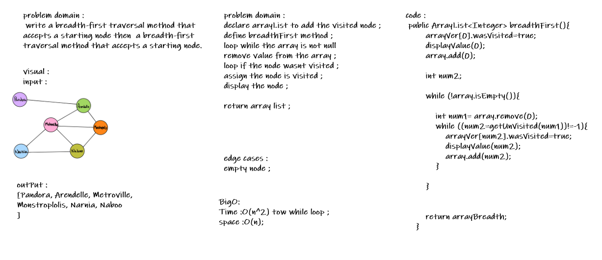

# Graph
<!-- Short summary or background information -->
 write a breadth-first traversal method that accepts a starting node then  a breadth-first traversal method that accepts a starting node. 
## Challenge
<!-- Description of the challenge -->
- declare arrayList to add the visited node ;
 - define breadthFirst method ;
 - loop while the array is not null 
- remove value from the array ;
- loop if the node wasnt visited ;
- assign the node is visited ;
- display the node ;
## Approach & Efficiency
<!-- What approach did you take? Why? What is the Big O space/time for this approach? -->

- O(n^2) Time 
- O(n) Space

## Solution
<!-- Embedded whiteboard image -->

