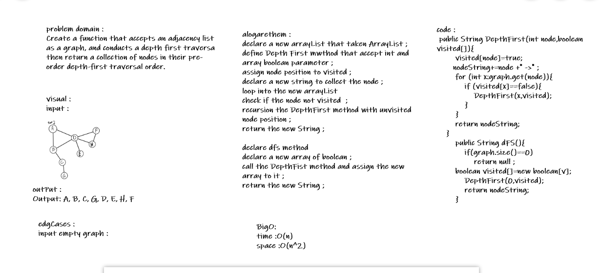

# Graph
<!-- Short summary or background information -->
Create a function that accepts an adjacency list as a graph, and conducts a depth first traversa then return a collection of nodes in their pre-order depth-first traversal order.## Challenge
<!-- Description of the challenge -->
- declare a new arrayList that taken ArrayList ;
 - define Depth First mwthod that accept int and array boolean parameter ;
 - assign node position to visited ;
 - declare a new string to collect the node ;
 - loop into the new arrayList 
 - check if the node not visited  ;
 - recursion the DepthFirst method with unvisited node position ;
 - return the new String ;

 - declare dfs method 
 - declare a new array of boolean ;
 - call the DepthFist method and assign the new array to it ;
 - return the new String ;

## Approach & Efficiency
<!-- What approach did you take? Why? What is the Big O space/time for this approach? -->

- O(n) Time 
- O(n^) Space

## Solution
<!-- Embedded whiteboard image -->

