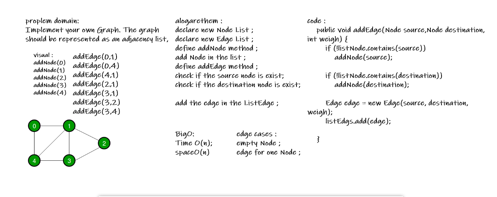

# Graph
<!-- Short summary or background information -->
Implement your own Graph. The graph should be represented as an adjacency list,

## Challenge
<!-- Description of the challenge -->
### AddNode()
 - Adds a new node to the graph
- Takes in the value of that node
 - Returns the added node.
  * Efficiency :
 O(1) Time 
 O(1) Space
### AddEdge()
- Adds a new edge between two nodes in the graph
- Include the ability to have a “weight”
- Takes in the two nodes to be connected by the edge
 - Both nodes should already be in the Graph
 * Efficiency :
 O(1) Time 
 O(1) Space
### GetNodes()
 - Returns all of the nodes in the graph as a  collection (set, list, or similar)
 * Efficiency :
 O(n) Time 
 O(1) Space
### GetNeighbors()
 - Returns a collection of edges connected to the given node
 - Takes in a given node
 - Include the weight of the connection in the  returned collection
 * Efficiency :
 O(n) Time 
 O(1) Space
### Size()
Returns the total number of nodes in the graph
* Efficiency :
 O(1) Time 
 O(1) Space
## Approach & Efficiency
<!-- What approach did you take? Why? What is the Big O space/time for this approach? -->
- declare new Node List ;
 - declare new Edge List ;
- define addNode method ;
- add Node in the list ;
- define addEdge method ;
- check if the source node is exist;
- check if the destination node is exist;

 - add the edge in the ListEdge ;

- O(n) Time 
- O(n) Space

## Solution
<!-- Embedded whiteboard image -->

