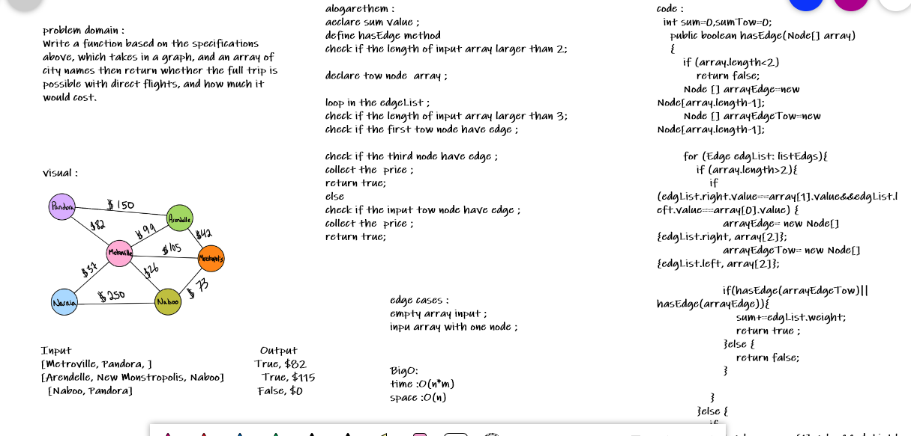

# Graph
<!-- Short summary or background information -->
Write a function based on the specifications above, which takes in a graph, and an array of city names then return whether the full trip is possible with direct flights, and how much it would cost.
## Challenge
<!-- Description of the challenge -->
- aeclare sum value ;
- - define hasEdge method 
 - check if the length of input array larger than 2;
- declare tow node  array ;

- loop in the edgeList ;
- check if the length of input array larger than 3;
- check if the first tow node have edge ;

- check if the third node have edge ;
- collect the  price ;
- return true;
 
- else check if the input tow node have edge ;
- collect the  price ;
- return true;
## Approach & Efficiency
<!-- What approach did you take? Why? What is the Big O space/time for this approach? -->

- O(n*m) Time 
- O(n) Space

## Solution
<!-- Embedded whiteboard image -->

