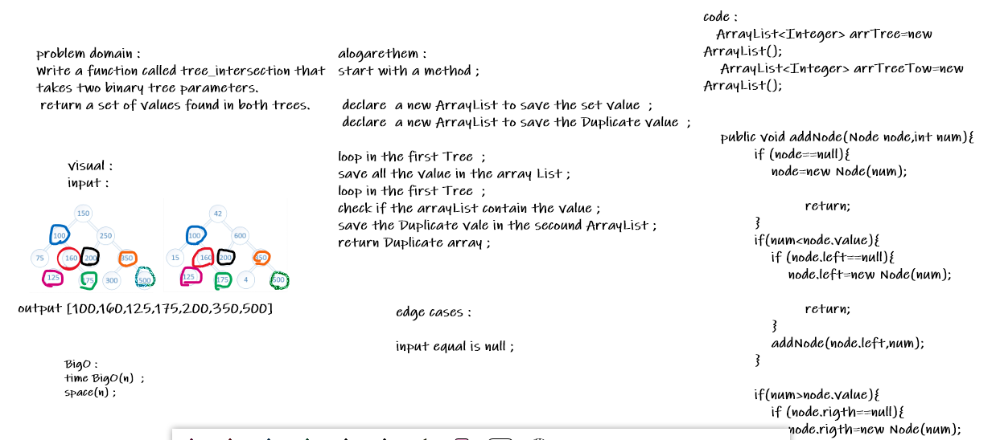

# Repeated Word
<!-- Short summary or background information -->
return array with equal values ;

## Challenge
<!-- Description of the challenge -->
Write a function called tree_intersection that takes two binary tree parameters.
 return a set of values found in both trees.

## Approach & Efficiency
<!-- What approach did you take? Why? What is the Big O space/time for this approach? -->
Created an array list to hold the equal values ;
declare tow  new stack to save root value  ;
loop in the tow Tree  ;
check if root1 is not null 
check if root2 is not null 
check if the tow stack  is not empty
check if root1 is equal root2
check if root1 is not equal root2
return Equal values  ArrayList  ; 

- O(n) Time 
- O(n) Space

## Solution
<!-- Embedded whiteboard image -->

