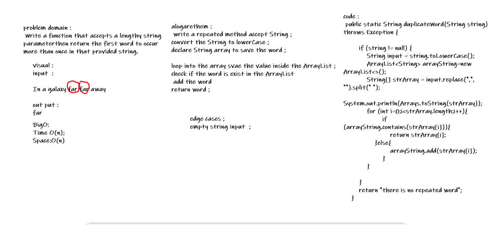

# Repeated Word
<!-- Short summary or background information -->
return first duplicate word from a string

## Challenge
<!-- Description of the challenge -->
Write a function that accepts a lengthy string parameter.
Without utilizing any of the built-in library methods available to your language, return the first word to occur more than once in that provided string.

## Approach & Efficiency
<!-- What approach did you take? Why? What is the Big O space/time for this approach? -->
 declare  a new ArrayList to save the set value  ;
 declare  a new ArrayList to save the Duplicate value  ;

loop in the first Tree  ;
save all the value in the array List ;
loop in the first Tree  ;
check if the arrayList contain the value ;
save the Duplicate vale in the secound ArrayList ;
return Duplicate array ;

- O(n) Time 
- O(n) Space

## Solution
<!-- Embedded whiteboard image -->

