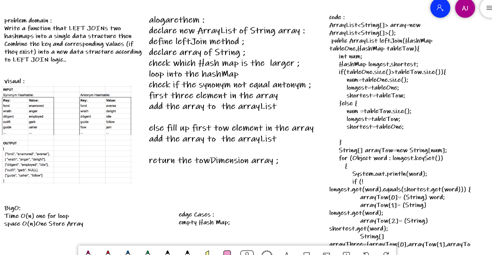

# Left Join
<!-- Short summary or background information -->
Write a function that LEFT JOINs two hashmaps into a single data structure.
## Challenge
<!-- Description of the challenge -->
- Write a function that LEFT JOINs two hashmaps into a single data structure.
- The first parameter is a hashmap that has word strings as keys, and a synonym of the key as values.
 - The second parameter is a hashmap that has word strings as keys, and antonyms of the key as values.
- Combine the key and corresponding values (if they exist) into a new data structure according to LEFT JOIN logic.
- LEFT JOIN means all the values in the first hashmap are returned, and if values exist in the “right ” hashmap, they are appended to the result row. If no values exist in the right hashmap, then some flavor of NULL should be appended to the result row.
- The returned data structure that holds the results is up to you. It doesn’t need to exactly match the output below, so long as it achieves the LEFT JOIN logic

## Approach & Efficiency
<!-- What approach did you take? Why? What is the Big O space/time for this approach? -->

define leftJoin method ;
declare new towDimension array :
loop into the hashMap 
check if the synonym not equal antonym ;
fill up the tow raw in the array ;

else fill up the three raw in the array ;

return the towDimension array ;
- O(n) Time 
- O(n) Space

## Solution
<!-- Embedded whiteboard image -->

