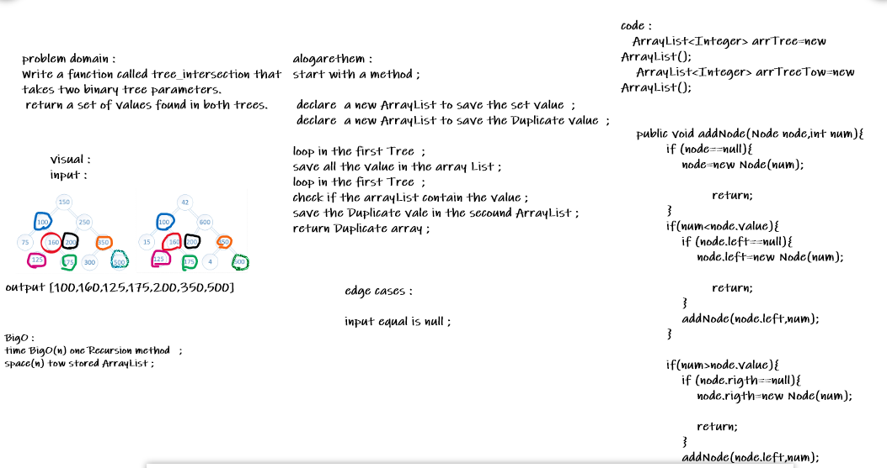

# Repeated Word
<!-- Short summary or background information -->
return array with equal values ;

## Challenge
<!-- Description of the challenge -->
Write a function called tree_intersection that takes two binary tree parameters.
 return a set of values found in both trees.

## Approach & Efficiency
<!-- What approach did you take? Why? What is the Big O space/time for this approach? -->
 declare  a new ArrayList to save the set value  ;
 declare  a new ArrayList to save the Duplicate value  ;

loop in the first Tree  ;
save all the value in the array List ;
loop in the first Tree  ;
check if the arrayList contain the value ;
save the Duplicate vale in the secound ArrayList ;
return Duplicate array ;

- O(n) Time 
- O(n^2) Space

## Solution
<!-- Embedded whiteboard image -->

