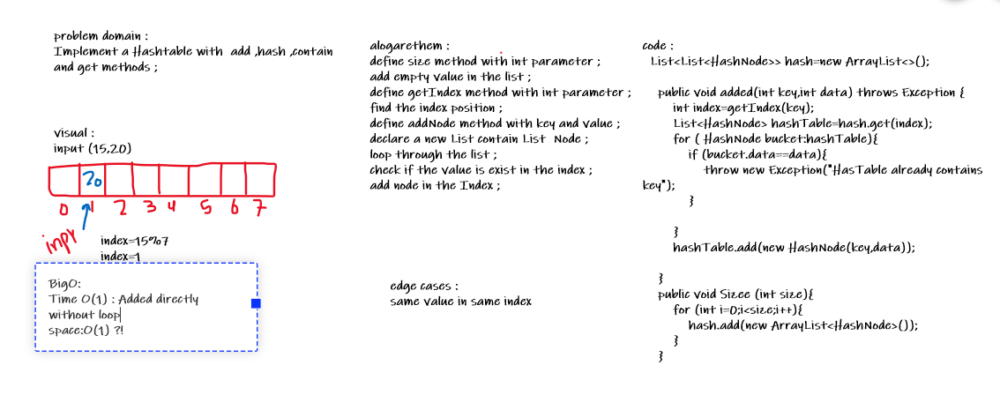

# Hashtables
Implement a Hashtable

## Challenge
Implement a Hashtable with methods `add`, `get`, `contains`, and `hash`

## Approach & Efficiency
A list of lists that each store nodes containing key value pairs.
Time Efficiency: O(1)
Space Efficiency: O(1)

## API

 - define size method with int parameter ;
 - add empty value in the list ;
  - define getIndex method with int parameter ;
 - find the index position ;
 - define addNode method with key and value ;
 - declare a new List contain List  Node ;
 - loop through the list ;
 - check if the value is exist in the index ;
 - add node in the Index ;

 

